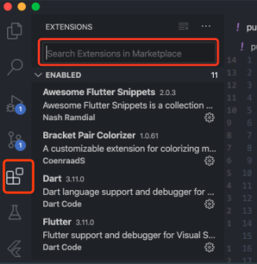
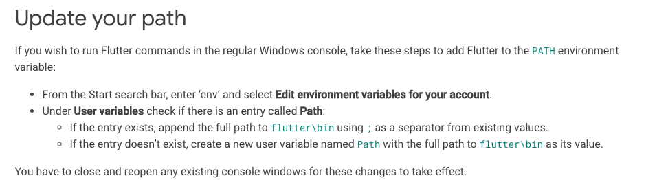
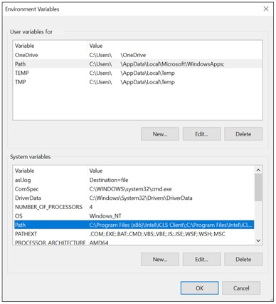
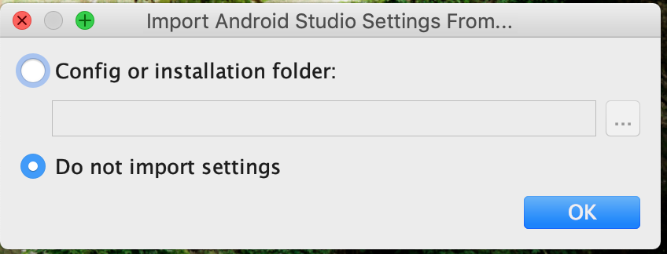
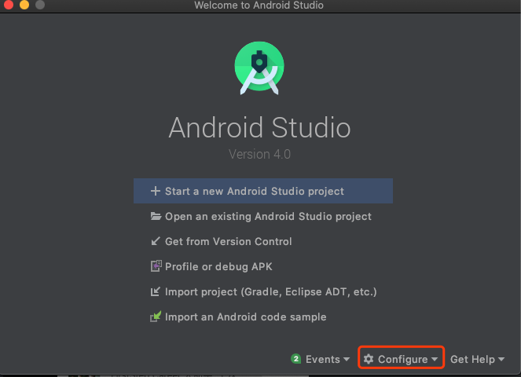
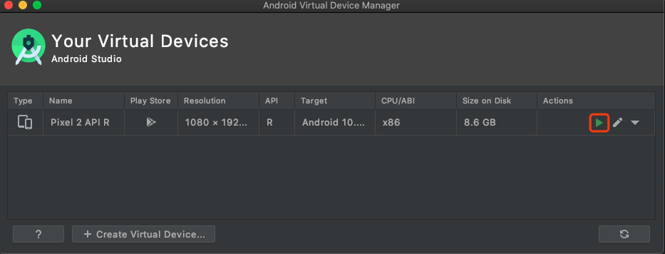
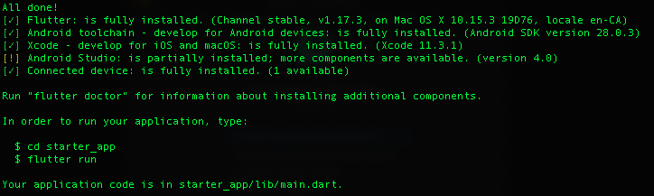

# **Lecture 1**

## Table of Contents
1. VSCode, Flutter, and Android Studio Installation
2. Starter App Creation
3. Dart Language Introduction

## **1. Install VSCode, Flutter, and Android Studio**

### **VSCode**
- Go to https://code.visualstudio.com/ to download Vscode
- Then open VSCode and click here, you should see extension search bar
  - 
- Install Extensions
  - Dart
  - Flutter
  - Awesome Flutter Snippets
  - Flutter Widget Snippets
  - Remote-ssh
  - Others
    - TabNine
    - Bracket Pair Colorizer
    - GitLens
    - One Dart Pro
    - Vim & Relative Line Numbers (if you are into Vim)

### **Flutter**
- You don't have to look at my 'Steps breakdown', simply following the instructions in the links should work.
  - **It is important to practice your ability to install any tool as a Software Engineer!**
- **Mac**: https://flutter.dev/docs/get-started/install/macos
  - Steps breakdown:
    - Download zip file and extract
    - Open terminal run ``export PATH="$PATH:`pwd`/flutter/bin"`` to update flutter path
      - `pwd` is a command you can use to display the current directory
        - e.g. If you extracted zip under `Desktop`, then it should be `/<some directory>/Desktop`
    - Run `which flutter`
      - You should see the path gets printed out, if not, then there's something wrong you should try exporting the correct path
      - 
- **Windows**: https://flutter.dev/docs/get-started/install/windows
  - Steps Breakdown:
    - Download zip file and extract
    - Update your path following this instruction
      - 
      - If you are not sure what environment variables look like, it should look like this
        - 
    - Open CMD and start type `where flutter` or `which flutter` depending on your Windows version. (Or just see if `flutter` command works)

### **Android Studio Simulator**
- Install Android Studio
  - https://developer.android.com/studio
  - Open installer, click through `next` to start installing the packages
    - For this step just click `do not import settings`
      - 
- After you successfully installed, you should see this
  - 
- Configure Android Simulator
  - Click `Configure` => `AVD Manager` => `Create virtual device`
    - Click through and install R
      - 
  - After you are done, click `Configure` => `AVD Manager`
    - You should see this and click play button to start the simulator
      - 

## **2. Create your starter project**
- Open Android simulator
  - Click play button
- On terminal (MAC) or CMD (Windows)
  - run `flutter create [your_app_name]`
    - In this demo, call `flutter create starter_app`
    - You should see 
  - Do `cd starter_app`
  - Do `flutter run`
    - Wait for a bit for it to run
    - **Note**: if you encounter any error, try `flutter doctor` to see what the issue is, you might need to
      - fix android license
      - reinstall Android SDK tool
- You should be able to see the starter app to show up like this:

  

## **3. Dart Programming Language**
From wiki, "Dart is an **object-oriented**, **class-based,** **garbage-collected** language with C-style syntax".

### **1. Basic usage**

#### `main` function:
```dart
void main() {
    print('Hello, World!'); // Hello, World!
}
```
  - Entry point of the run-time application
  - **Note**: Not necessarily the first to start, need to startup some run-time environment/library (c/c++)


#### Variable Definition:
- Common types:
  - int
  - double
  - String
  - array []
  - ...

- `var`: a variable that's able to change its value
- `dynamic`: change value and change type
- `const`: compile-time constant
- `final`: run-time constant, variable can only be assigned once
  - similar to `Java`'s `final`
  - compile-time vs. run-time?
    - compile-time: compile my codebase to an executable
    - runtime: running an instance of an executable
- **Note:** initial value of every variable is null , unlike C/C++
  - Stack: garbage value
  - global variable/heap: `int` => 0


#### Function call
```dart
void myName() {
  print('Cody'); // Cody
}

void anyName(String name) {
  print(name);
}
```
**Passing function as a parameter**
```dart
String iChangeName(String name) {
  return name + 'ly';
}
void anyNameWithChange(String name, change) {
  var newName = change(name);
  print(newName);
}
```
- A function can be passed in as a parameter

**If condition**
```dart
bool a = false;
if (a) {
    a = true;
}
else {
    a = false;
}
OR
a = a ? false : true //ternary operator
```

**For loop**
```dart
int a = 5;
for (var i = 0; i < a; i++) {
  print('Hello ${i+ 1}'); // Hello 1 - Hello 5
}
```

### **2. Object-oriented with Dart**

**Class Definition**
```dart
class Car {
  String identifier;
  String make;
  String model;
  int maxSeats;

  // Constructor
  Car(identifier, make, model, maxSeats) {
    this.identifier = identifier;
    this.make = make;
    this.model = model;
    this.maxSeats = maxSeats;
  }
}

Car car = Car("Cody", "bmw", "x5", 5);
print(car.make); // bmw
print(car.model); // x5
print(car.maxSeats); // 5
```
- Would `Car car = Car()` work? (default constructor)
  - default constructor: constructor that has no arguments
  - Dart: removes default constructor when custom constructor is defined
  - (c++: default constructor is always ok to use, unless placed under private)

**Member method**
```dart
class Car {
  // variables
  // constructor

  String fullModel() {
    return this.make + ' ' + this.model;
  }
}

Car car = Car('abc', "bmw", "x5", 5);
print(car.fullModel()); // bmw x5
```

**Inheritance (is-a)**
```dart
class SUV extends Car {
  SUV(identifier, make, model, maxSeats): super(identifier, make, model, maxSeats);

  @override
  String fullModel() {
    return "SUV: " + make + model;
  }
}
```
- `super`: calls parent's class's construct
- `override`: overrides parent's class's member method

**Composition (has-a)**
```dart
class SUV2 {
  Car car;
  SUV2(Car car) { // instantiated with Car class
    this.car = car;
  }

  String fullModel() {
    return "SUV2: " + car.make + ' ' + car.model;
  }
}
```

- `Inheritance` vs. `Composition`?
  - Inheritance: reuseable code
  - Composition: less dependency, allow better unit testing
  - In industry, people prefer Composition over Inheritance when given a choice due to large project size

**Polymorphism**: same representations can have different meanings
```dart
Car car = Car("Cody", "bmw", "x5", 5);
SUV suv = SUV('abc', "bmw", "a2", 5);
SUV2 suv2 = SUV2(car);

print(car.fullModel()); // bmw x5
print(suv.fullModel()); // SUV: bmw a2
print(suv2.fullModel()); // SUV2: bmw x5
```

**Abstract Class/Interface**: class that cannot be instantiated but can be inherited
```dart
abstract class Vehicle {
  String identifier;
  String make;
  String model;
  int maxSeats;

  String fullModel();
}

class Car extends Vehicle {

  Car(identifier, make, model, maxSeats) {
    this.identifier = identifier;
    this.make = make;
    this.model = model;
    this.maxSeats = maxSeats;
  }

  String fullModel() {
    return make + model;
  }
}
```

Putting all code together:
```dart
abstract class Vehicle {
  String identifier;
  String make;
  String model;
  int maxSeats;

  String fullModel();
}


class Car extends Vehicle {
//   String identifier;
//   String make;
//   String model;
//   int maxSeats;

  // Constructor
  Car(identifier, make, model, maxSeats) {
    this.identifier = identifier;
    this.make = make;
    this.model = model;
    this.maxSeats = maxSeats;
  }

  String fullModel() {
    return this.make + ' ' + this.model;
  }
}

class SUV extends Car { // inheritance
  SUV(identifier, make, model, maxSeats): super(identifier, make, model, maxSeats);

  @override
  String fullModel() {
    return "SUV: " + make + ' ' + model;
  }
}

class SUV2 { // composition
  Car car;
  SUV2(Car car) { // instantiated with Car class
    this.car = car;
  }

  String fullModel() {
    return "SUV2: " + car.make + ' ' + car.model;
  }
}


void main() {

Car car = Car("Cody", "bmw", "x5", 5);
SUV suv = SUV('abc', "bmw", "a2", 5);
SUV2 suv2 = SUV2(car);
print(car.make); // bmw
print(car.model); // x5
print(car.maxSeats); // 5
print(car.fullModel()); // bmw x5
print(suv.fullModel()); // SUV: bmw a2
print(suv2.fullModel()); // SUV2: bmw x5
}

```