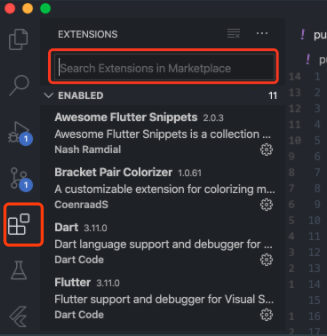
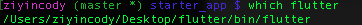
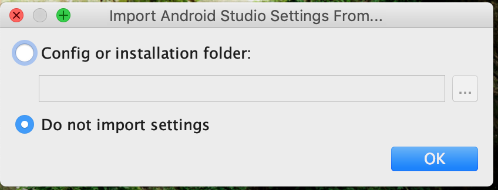
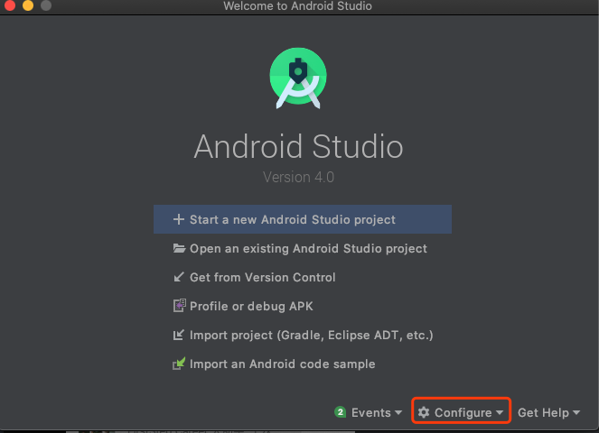
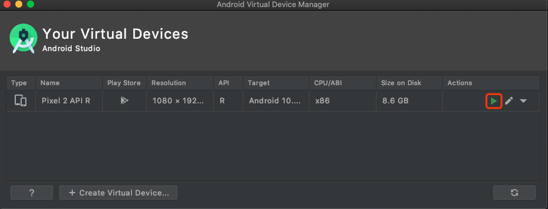

# **Lecture 1**

## **Install VSCode and Flutter**

### **VSCode**
- Go to https://code.visualstudio.com/ to download Vscode
- Then open VSCode and click here, you should see extension search bar
  - 
- Install Extensions
  - Dart
  - Flutter
  - Awesome Flutter Snippets
  - Flutter Widget Snippets
  - Remote-ssh
  - Others
    - TabNine
    - Bracket Pair Colorizer
    - GitLens
    - One Dart Pro
    - Vim & Relative Line Numbers (if you are into Vim)
  
### **Flutter**
- You don't have to look at my 'Steps breakdown', simply following the instructions in the links should work.
  - **It is important to practice your ability to install any tool as a Software Engineer!**
- **Mac**: https://flutter.dev/docs/get-started/install/macos
  - Steps breakdown:
    - Download zip file and extract
    - Open terminal run ``export PATH="$PATH:`pwd`/flutter/bin"`` to update flutter path
      - `pwd` is a command you can use to display the current directory
        - e.g. If you extracted zip under `Desktop`, then it should be `/<some directory>/Desktop`
    - Run `which flutter`
      - You should see the path gets printed out, if not, then there's something wrong you should try exporting the correct path
      - 
- **Windows**: https://flutter.dev/docs/get-started/install/windows
  - Steps Breakdown:
    - Download zip file and extract
    - Update your path following this instruction
      - 
      - If you are not sure what environment variables look like, it should look like this
        - 
    - Open CMD and start type `where flutter` or `which flutter` depending on your Windows version. (Or just see if `flutter` command works)

### **Android Studio Simulator**
- Install Android Studio 
  - https://developer.android.com/studio
  - Open installer, click through `next` to start installing the packages 
    - For this step just click `do not import settings`
      - 
- After you successfully installed, you should see this
  - 
- Configure Android Simulator
  - Click `Configue` => `AVD Manager` => `Create virtual device`
    - Click through and install R
      - 
  - After you are done, click `Configue` => `AVD Manager`
    - You should see this and click play button to start the simulator
      - 

### **Create your starter project**
- Open Android simulator
  - Click play button
- On terminal (MAC) or CMD (Windows)
  - run `flutter create starter_app`
    - You should see 
  - Do `cd starter_app`
  - Do `flutter run`
    - Wait for a bit for it to run
- You should be able to see the starter app to show up like this
 

