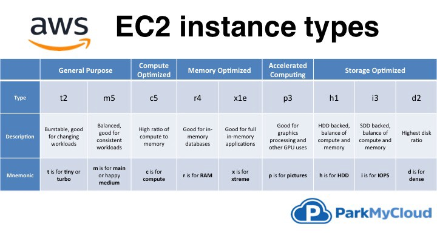
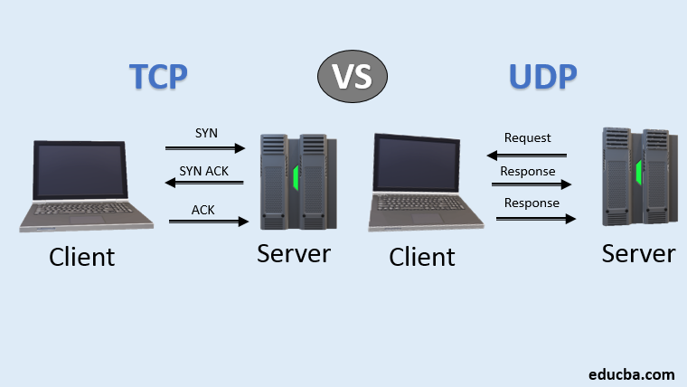
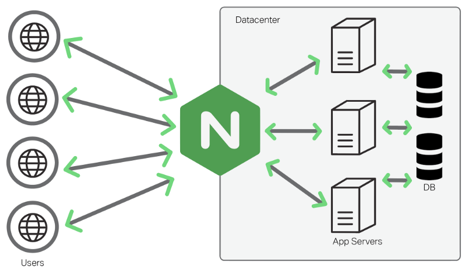
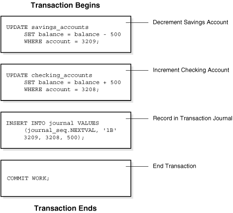

# Lecture 13

## Tasks for you
1. Add more fields to the database, such as 
```
priceRange
category1
category2
rating
image_url
```
- So you need to modify `restaurant.py` in order to do so
  - hint: `rating` is `NumberAttribute()`
  - Documentation for different types: https://pynamodb.readthedocs.io/en/latest/tutorial.html#defining-model-attributes
2. `git pull` the flutter repo from our course repo
3. In frontend, call this server's endpoint and see if you can get the same results

## New Technologies so far
- AWS
  - EC2
  - IAM
  - Security Group
- Nginx
- DynamoDB (pynamodb)

## AWS EC2
- Virtual server with different configurations
  - `image`: Operating Systems
  - `Instance type`: a1.medium, t3.micro, ...

  - Different instance has different processors, different storage and number of cores, or even GPUs
  - What are cores/CPUs useful for? Parallel Processing
- `QPS`: Queries per Second
  - How many query request the server can handle in one second
  - Important when deciding how many servers you need for your application
- `Latency`: or lag, meaning how long does it take for a query to process/take effect
  - `QPS` = 60 / `latency` / `num of cores`


## Security Group
- `Port`: use to specify a particular process running on a host
  - `Http` uses port 80, `ssh` uses port 22, email server port often uses 25 with `SMTP` protocol
  - `0 - 1023`: well-known port numbers.
    - Reason why these port numbers needed root user priviledge
  - `1024 - 49151`: can be registered to specific protocols for software
  - `49151 - 64999`: 
- `TCP vs. UDP`:
  - Both are network protocols
    - What does `protocol` mean? Some specified rules must be satisfied
    - `TCP` is more reliable because of **handshake** property

      - `handshake`: client and server must acknowledge each other before being established
      - No miss packets, but rely on good resources to reduce lag
      - `TCP/IP`: use TCP and IP protocols to establish `Internet Protocol Suite`, `http` is built on top of `TCP/IP`
    - `UDP` is simpler and faster, because doesn't need handshake

      - more unreliable, can miss packets
  - Examples:
    - Sending email: `TCP`
    - Video Streaming: `UDP`

## Nginx
- `Proxy server`: acts as intermediary between client and server

  - `forward proxy server`: client puts in front of itself to firstly receive request from the server 
    - Application: bypass firewall
  - `Reverse proxy server`: server puts in front of itself that gets resource on behalf of clients from the server
    - Application: load balancing, means balancing the load for each server (more later)
- Which one is Nginx?

## Database
- SQL vs NoSQL
  1. SQL is `table-based`, NoSQL is `document-based`
  2. SQL schema must be defined first and fixed, NoSQL schema can be modified
  3. SQL provides `ACID` properly to allow `transactions`, while only a few nosql database can achieve this
    - `Transaction`: a unit of work

    - `ACID`: atomicity, consistency, isolation, durability
      - `atomicity（原子性）`: all operations finish or none
      - `consistency （一致性）`: ensure database properly changes state when transaction is committed
      - `isolation （隔离性）`: each transaction operate independently
      - `durability （持久性）`: commit is permanant 
    - https://blog.csdn.net/dengjili/article/details/82468576
    - Application: Banking, ATM machine
      - E.g. 1. Withdrawing \$30 from your chequeing account. 2. Put $50 to your investment account
  4. SQL database uses SQL query language, NoSQL has no such a thing
  5. SQL has built-in indexing, NoSQL needs to declare (more on this later)