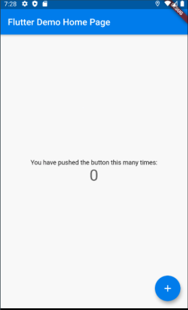

# **Lecture 2**

## **UI Component**

### **Beginner project**

The starter project is essentially an app that you can increment the number on the center.



```dart
import 'package:flutter/material.dart';
```
`Material.dart` is the library for Material Design
- Defines the major UI regions, components
  - https://material.io/components
  - Same default designs as Android
- `cupertino.dart` if you are interested in native iOS component
  - https://flutter.dev/docs/development/ui/widgets/cupertino


### **Widgets**: UI components

- `Widget`:
- `Widget Tree`: Think about the entire UI as a tree structure, where each node is a widget

```dart
void main() {
  runApp(MyApp());
}
```
- `runApp` ___ with `MyApp` being __

```dart
class MyApp extends StatelessWidget {
  // This widget is the root of your application.
  @override
  Widget build(BuildContext context) {
    return MaterialApp(
      title: 'Flutter Demo',
```
- `StatelessWidget`: ___
  - `state`: ___ (e.g. value of its member variables)
  - All variables should in theory be marked as `final`
    - why?
- `build`: ___
  - Called when the ___ the widget is built or when the widget is __
  - `BuildContext` contains context info regarding to a widget location
- `MaterialApp`: Material design of the app
  - `CupertinoApp` to create iOS like style
- `MaterialApp` is the ___ of `MyApp`
---
```dart
class MyHomePage extends StatefulWidget {
  MyHomePage({Key key, this.title}) : super(key: key);
  final String title;
```
- `StatefulWidget`: ___
  - Uses method `setState` to modify state changes (try without `setState`)
    ```dart
    int _counter = 0;

    void _incrementCounter() {
      setState(() {
        _counter++;
      });
    }
    ```
- Why does the function begin with `_`? ___
  - In flutter, there's no `private`, `protected` keywords
  - `private` is handles in ___
    - example

```dart
return Scaffold(
  appBar: AppBar(
    title: Text(widget.title),
  ),
  body: Center(
    child: Column(
      mainAxisAlignment: MainAxisAlignment.center,
      children: <Widget>[
        Text(
          'You have pushed the button this many times:',
        ),
        Text(
          '$_counter',
          style: Theme.of(context).textTheme.headline4,
        ),
      ],
    ),
  ),
```
- `AppBar`: the bar on top
  - Also called `NavigationBar` in iOS terms
  - `Text`: text widget
- `Center`: ___
- `Column`: ___
  - `mainAxisAlignment`: alignment on the main axis
    - `MainAxisAlignment.center`
    - `MainAxisAlignment.start`
    - `MainAxisAlignment.end`
  - What happens if I do `CrossAxisAlignment.start`?
  - `Row`: ___
  - `Stack`:  ___
- `Theme.of(context)`: get theme information defined within the context

```dart
floatingActionButton: FloatingActionButton(
  onPressed: _incrementCounter,
  tooltip: 'Increment',
  child: Icon(Icons.add),
), 
```
- `FloatingActionButton`
  - `onPressed`
  - `tooltip`
  - `child`

`Widget Tree`
```
MyApp
- MaterialApp
  - MyHomePage
    - Scaffold
      - AppBar
      - Center
        - Column
          - Text
          - Text
        - FloatingActionButton
          - Icon
```

---

### **Hot reload**

There are two ways to hot reload
- Save the file (command/ctrl + s)
  - It is also recommended to enable auto save in VSCode
    - Settings => 'Auto Save' => 'After delay'
- Click the yellow bolt button

Restart
- Click the green circular arrow

---

## **Task for you**

1. Create a private function `_decrement()` that decrements the value by 1, and modify the floatingActionButton to do crement instead with icon `-` (I'll go over this)
2. Recreate the `+` button on bottom left
   1. **hint**: Try with `Stack` and `Align` (do some google search on this)
   2. Put `Stack` of widgets inside `floatingActionButton`
3. Pop up an `Alert` whenever the number hits 0 or hits 10, tells the user it cannot decrement after 0, nor cannot increment after reaches 10.
   1. **hint**: look up function `showDialog`
4. Try with other Button UI and take a look at the difference
     - `MaterialButton`
     - `IconButton`
     - `FlatButton`
     - `RaisedButton`
---

## Git/Github

### **Most Used Commands**
- `git init`:
- `git clone`:
- `git commit -m "MESSAGE"`:
- `git remote add origin URL`: 
- `git push origin <BRANCH>`:
- `git checkout -b <BRANCH>`:
- `git log`:
- https://help.github.com/en/github/importing-your-projects-to-github/adding-an-existing-project-to-github-using-the-command-line