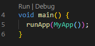

# **Lecture 3**

## Table of Contents
1. Unit Testing
2. Course Project
3. Homework

---
## **1. Unit Testing**
- TDD: test-driven development
- Tests correctness of individual components of a codebase
- Demo test path: `Lecture3/lecture_3/test/widget_test.dart`
- To start a test, click 'run' button above the code:

 

```dart
void main() {
  testWidgets('Counter increments smoke test', (WidgetTester tester) async {
    // Build our app and trigger a frame.
    await tester.pumpWidget(MyApp());

    // Verify that our counter starts at 0.
    expect(find.text('0'), findsOneWidget);
    expect(find.text('1'), findsNothing);

    // Tap the '+' icon and trigger a frame.
    await tester.tap(find.byIcon(Icons.add));
    await tester.pump();

    // Verify that our counter has incremented.
    expect(find.text('0'), findsNothing);
    expect(find.text('1'), findsOneWidget);
  });
}
```
- `findsOneWidget`: means one widget is found
- `findsNothing`: no widget is found given the condition
---
## **2. Course Project**


To save the project's source code locally on your laptop, get SSH key from github repository's home page and run `git clone [repo ssh key]` in git bash terminal


### **main.dart**

Path: `Lecture3/lecture_3/lib/main.dart`
```dart
// line 12
return MaterialApp(
  home: HomeView(), // go to definition, jump to home_view.dart
);
```

### **home_view.dart**

Path: `Lecture3/lecture_3/lib/ui/views/home_view.dart`

**1. static**
```dart
// line 10
static List<String> categories = ['American', 'French', 'Dessert', 'Bar'];
static List<String> categoryImgs = [
  'Burger.png',
  'Beverage.png',
  'Dessert.png',
  'Cocktails.png'
];
static Restaurant res = Restaurant("Steve's Smoke House", '\$\$', 'Steak',
    'American', 4.5, 'assets/res1.png');
```
- `static`: class-wide state and constants, not accessible to instances
- it is conventional to use `static` here, because the variables we defined are typically not going to be called on object level

```dart
// for example

class Car {
  static int b = 0;

  // Constructor
  ...
}

void main() {
  Car bmw = Car("Cody", "bmw");
  print(bmw.make); // bmw
  print(Car.b); //0
  // because b is static, it is called on class level
}
```
**2. SafeArea**
```dart
return Scaffold( // if you are using an AppBar
  body: SafeArea(
    child: ...
```
- `SafeArea`: displays widgets below the status bar at the top of the phone screen

**3. TextStyle**
```dart
Text(
    'Good morning, Annie',
    style: TextStyle(fontSize: 24, fontWeight: FontWeight.bold),
    // style defined by TextStyle
),
```

**4. Row**
```dart
Row(
    children: <Widget>[
      Expanded(
        child: RaisedButton(
          color: Colors.white,
          onPressed: () {},
          shape: RoundedRectangleBorder(
            borderRadius: BorderRadius.circular(20),
          ),
        ),
      ),
      SizedBox(width: 5), // add some space in between
      ButtonTheme(
        minWidth: 20,
        child: FlatButton(
            child: Image.asset('assets/filter.png'),
            onPressed: () {}),
      ),
    ],
  ),
```
- `Expanded`: expand the widget to take on any remaining width/height
- `RoundedRectangleBorder`
- `ButtonTheme`
- `Image.asset` get image given specified path

**5. Container**
```dart
Container( // use it when it has an arbitrary length
  height: 80,
  child: ListView.builder(
      scrollDirection: Axis.horizontal,
      itemCount: categories.length,
      itemBuilder: (BuildContext context, int index) {
        return CategoryButton(
            categoryName: categories[index],
            categoryImg: categoryImgs[index]);
      }),
),
```
- `ListView.builder`: allow arbitrary length, and scrollable
- Why wrap around with a `Container`?
  - Because it's arbitrary, inside a Column, need to know the underlying dimension

**6. Align**
```dart
Align(
  alignment: Alignment.centerLeft,
  child: Text(
    'Popular Near You',
    style: TextStyle(fontSize: 24, fontWeight: FontWeight.bold),
  ),
),
SizedBox(height: 5),
Container(
  height: 200,
  child: ListView(
    scrollDirection: Axis.horizontal,
    children: <Widget>[
      ResCard(res: res),
      SizedBox(width: 10),
      ResCard(res: res),
    ],
  ),
)
```
**7. CategoryButton**
```dart
class CategoryButton extends StatelessWidget {
  final String categoryName;
  final String categoryImg;

  CategoryButton({@required this.categoryName, @required this.categoryImg});
  @override
  Widget build(BuildContext context) {
    return Padding(
      padding: const EdgeInsets.all(8.0),
      child: Column(
        children: <Widget>[
          RaisedButton(
            child: Image.asset('assets/$categoryImg'),
            onPressed: () {},
            color: Colors.white,
          ),
          SizedBox(height: 2),
          Text(categoryName, style: TextStyle(fontSize: 10)),
        ],
      ),
    );
  }
}
```
- what's `@required`
  - Default not required, adding it so that must be passed in

Can someone help me walk through this widget?

```dart
class ResCard extends StatelessWidget {
  final Restaurant res;
  ResCard({@required this.res});
  @override
  Widget build(BuildContext context) {
    return Container(
      width: 250,
      child: Card(
        child: Column(
          crossAxisAlignment: CrossAxisAlignment.start,
          children: <Widget>[
            Image.asset(res.resImage),
            Padding(
              padding: const EdgeInsets.fromLTRB(4, 4, 0, 0),
              child: Text(
                res.resName,
                style: TextStyle(fontSize: 20, fontWeight: FontWeight.bold),
              ),
            ),
            Padding(
              padding: const EdgeInsets.fromLTRB(4, 4, 0, 0),
              child: Row(
                children: <Widget>[
                  Text(
                      '${res.priceRange} • ${res.cuisineType1} • ${res.cuisineType2}'),
                  Expanded(child: SizedBox()),
                  Text('1.9 km'),
                ],
              ),
            ),
            Padding(
              padding: const EdgeInsets.fromLTRB(4, 4, 0, 0),
              child: Row(
                children: <Widget>[
                  Image.asset('assets/google_logo.jpg', height: 20, width: 20),
                  SizedBox(width: 2),
                  Text('4.5'),
                  SizedBox(width: 2),
                  Icon(Icons.star, size: 20),
                  Icon(Icons.star, size: 20),
                  Icon(Icons.star, size: 20),
                  Icon(Icons.star, size: 20),
                  Icon(Icons.star_half, size: 20),
                ],
```
---
## **3. Tasks for you**

1. Write a unit test for your decrement button

2. From what we learned in this lecture,
   1. Setup custom font (I'll show you this)
      1. Add google font to `pubspec.yaml`
      2. Let it install
      3. Import `google_font.dart` to `main.dart`
      4. Set `montserratTextTheme` as the default text theme
   2. Setup asset path in `pubspec.yaml` (I'll show you this)
      1. under `flutter:` inside `pubspec.yam`
      2. uncomment `assets:`
   3. Fill out info inside search bar
   4. Create the profile image
      1. **hint**: google at `CircularAvatar`
   5. Fix the size of category buttons using `buttonTheme`
   6. Fix padding inside resCard
   7. Try create a folder under `ui/`, name as `subview`, and then create a file named `res_card.dart`, then move widget `ResCard` to that file
   8. Create a list of Restaurant, and create a listview from that list of restaurant
