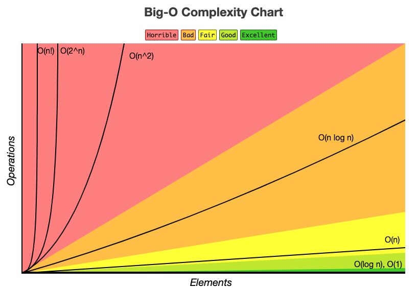

# Lecture 5

### Runtime Complexity
- Question: what's the runtime complexity for `json['resName']`
  - Answer: amortized `O(1)`
- Question: What's the total runtime of the loop?
  - Answer: amortized `O(n)`

- amount of time it takes an algorithm to run
- counts the number of elementary operations
- `O(1)`: constant runtime
- `O(log n)`: log runtime
- `O(n)`: linear runtime
- `O(n^2)`: quadratic runtime

### Hashtable
- `Dictionary` is a generic type (high level)
  - It could be implemented by `hashtable`
  - We always assume a dictionary is implemented using `hashtable`
- Implementation
  - `array + hash function`
    - `f(x) => index`
  - For example: a array of size 5, use hash function `f(x) = x mod 5`
  - Put (5, abc): `f(5) = 5 mod 5 = 0`
  - Put (7, dcf): `f(7) = 7 mod 5 = 2`
  - `[abc, null, dcf, null, null]`
  - Lookup 5: `f(5) = 0` => `abc`
  - SHA256
- Hashtable operations
  - Lookup: Average O(1), worst case O(n)
    - `f(10) = 10 mod 5 = 0` => 0 + 1 => 1
    - proof, google
  - Put: Average O(1), worst case O(n)
  - Delete: Average O(1), worst case O(n)
- More info refer to algorithm course

## Yelp API Endpoints
- Where do we get the json from?
- https://www.yelp.ca/developers/documentation/v3
- You can query lots of existing restaurant info

### Restful API/Endpoints
- `API`: application program interface
  - set of rules allow programs to talk to each other
- `REST`: Representational State Transfer
  - set of rules developers follow when creating API
  - `RPC`
  - `Advantage`: REST API is stateless, takes query parameters
- `Root endpoint`: e.g. https://www.youtube.com/
- `endpoint`: specific resource you are looking for
  - e.g. https://www.youtube.com/feed/trending
- `query parameters`: conditions when looking resources
  - e.g. https://www.youtube.com/feed/subscriptions?flow=1
    - flow=1 => gridview, flow=2 => listview
- `HTTP Methods`
  - `POST`: create
  - `GET`: read
  - `PUT`: update/replace
  - `PATCH`: update/modify
  - `DELETE`: delete
- ENdpoint structure:
  - `[scheme(https)]//[endpoint]?/[query parameters]

### Use Yelp API
- Create an account in yelp
- find your api key
- install `http` package in flutter
- Demo
  - `response.statusCode`
    - `200`: success
    - `400`: bad request
    - `401`: unauthorized
    - `404`: Not Found
    - `500`: Internal Server Error
  - `http header`: pass in additional information in http request

### Task for you
1. Create an account in yelp
2. Use yelp api to load 5 restaurants info in each of `American`, `Steak`, `Chinese`, `Korean`, `Japanese`
3. Deserialize all restaurants as `Restaurant` Objects
4. Move api code to `Api` class, and use it

